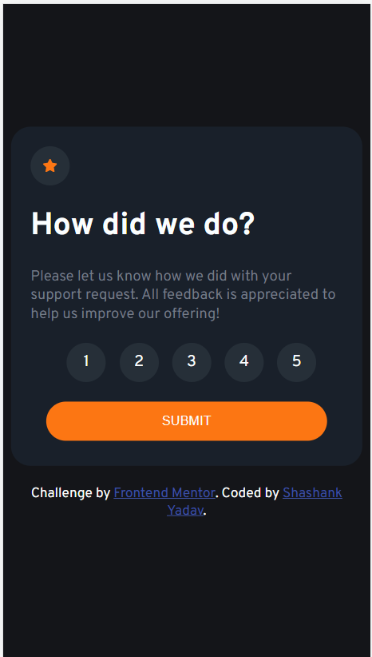

# Frontend Mentor - Interactive rating component solution

This is a solution to the [Interactive rating component challenge on Frontend Mentor](https://www.frontendmentor.io/challenges/interactive-rating-component-koxpeBUmI).

## Overview

This is a nice, small project to practice handling user interactions and updating the DOM. Easy to implement!

### The challenge

Users should be able to:

- View the optimal layout for the app depending on their device's screen size
- See hover states for all interactive elements on the page
- Select and submit a number rating
- See the "Thank you" card state after submitting a rating

### Screenshot

Add a screenshot of your solution. The easiest way to do this is to use Firefox to view your project, right-click the page and select "Take a Screenshot". You can choose either a full-height screenshot or a cropped one based on how long the page is. If it's very long, it might be best to crop it.

Alternatively, you can use a tool like [FireShot](https://getfireshot.com/) to take the screenshot. FireShot has a free option, so you don't need to purchase it.

Then crop/optimize/edit your image however you like, add it to your project, and update the file path in the image above.

### Links

- Solution URL: [Code hosted on github](https://github.com/yshashanky/interactive-rating-component-main)
- Live Site URL: [Live site URL](https://interactive-rating-component-yshashanky.netlify.app/)

### Built with

- Semantic HTML5 markup
- CSS custom properties
- Flexbox
- [Fonts](https://fonts.google.com/specimen/Overpass)

## Author

- Frontend Mentor - [@yshashanky](https://www.frontendmentor.io/profile/yshashanky)
- Github - [@yshashanky](https://github.com/yshashanky)
